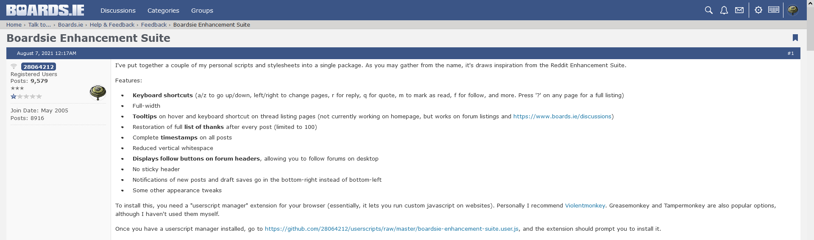
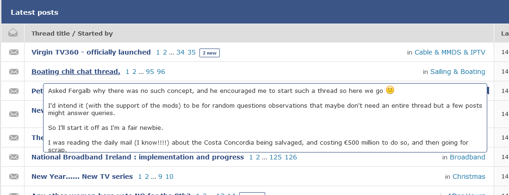
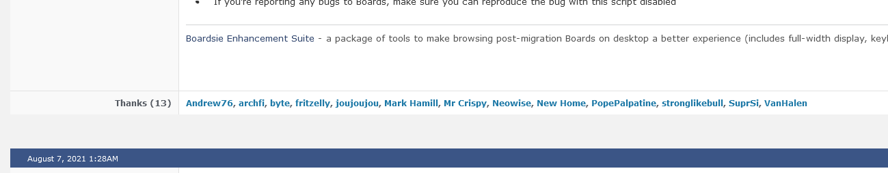
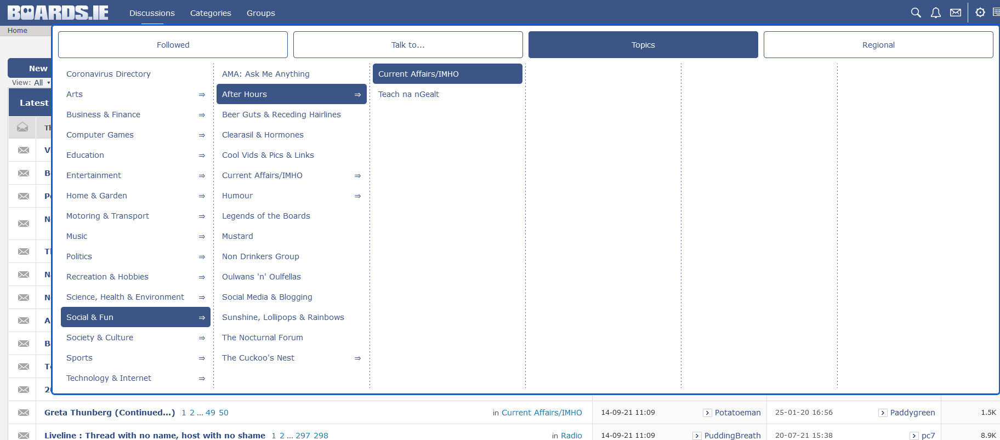

# Boardsie Enhancement Suite
Boardsie Enhancement Suite is an *unofficial* package of modifications designed to improve the desktop browsing experience on [Boards.ie](https://www.boards.ie).

* [Features](#features)
* [Installation](#installation)
* [Usage](#usage)
* [Disclaimers](#disclaimers)
* [Acknowledgements](#acknowledgements)

# Features
## Keyboard shortcuts
e.g. →/← for next/previous page, a/z to navigate posts, r to reply, q to quote, and many more

## Full-width display, minimal wasted space

## Dark mode setting

## Thread previews on hover

## Full list of thanks under all posts

## Category drop-down menu

# Installation
## Firefox
1. Click the [latest .xpi release](https://github.com/28064212/boardsie-enhancement-suite/releases/latest/download/boardsie-enhancement-suite.xpi), and confirm the install. Alternatively, you can download the .xpi file, and install using the following steps
1. In Firefox, open your "Add-ons and Themes" page (Ctrl+Shift+A, or go to the URL about:addons)
1. On the "Manage your Extensions" page, click the settings gear-wheel (top right), then "Install Add-on From File..."
1. Select the downloaded .xpi file

## Chrome
1. Download the [latest .zip release](https://github.com/28064212/boardsie-enhancement-suite/releases/latest/download/boardsie-enhancement-suite.zip), and unzip it somewhere (note that the unzipped files will need to stay in place after installation, so choose somewhere permanent)
1. In Chrome, open your "Extensions" page (Settings => More tools => Extensions, or go to the URL chrome://extensions)
1. Enable "Developer mode" (top right)
1. Click on "Load Unpacked" and choose the folder you unzipped the files to

## Edge
1. Download the [latest .zip release](https://github.com/28064212/boardsie-enhancement-suite/releases/latest/download/boardsie-enhancement-suite.zip), and unzip it somewhere (note that the unzipped files will need to stay in place after installation, so choose somewhere permanent)
1. In Edge, open your "Extensions" page (Settings => Extensions, or go to the URL edge://extensions)
1. Enable "Developer mode" (bottom left)
1. Click on "Load Unpacked" and choose the folder you unzipped the files to

# Updates
## Firefox
The extension will update as per your browser's extension settings (automatically, in most cases)

## Chrome, Edge
Unfortunately, these browsers do not allow automatic updates of non-store extensions. To update to a new release:
1. Download the [latest .zip release](https://github.com/28064212/boardsie-enhancement-suite/releases/latest/download/boardsie-enhancement-suite.zip)
1. Unzip the contents to the same folder that the extension is currently installed in, overwriting any existing files
1. In your browser, open the Extensions page
1. In the Boardsie Enhancement Suite section, click the Reload button

# Usage
The majority of features are applied just by installing the extension. Some less obvious features are explained here.

Keyboard shortcuts: the extension allows you to use the site almost entirely using your keyboard. To view the full list of keyboard shortcuts available, press '?' (Shift+/) after installation, or click the keyboard icon in the menu bar (top right).

Dark mode (and other configurable settings): dark mode is disabled by default. To turn it on, press 's' or click the settings icon in the menu bar (top-right) to bring up the settings menu.

# Disclaimers
This is a completely unofficial addon to the Boards site. The developer has no connection to Boards other than as a user, and Boards have not sanctioned it in any way.

The extension is designed with desktop in mind, mobile browsers are not supported. Mozilla Firefox and Google Chrome are the two main development targets, but bug reports for other (desktop) browsers are welcome.

Some features may break occasionally as Boards make changes to their site.

If you are reporting bugs or issues to Boards, ensure you can reproduce them with this extension disabled, to rule out any possible clashes.

# Acknowledgements
The [WebExtension browser API Polyfill](https://github.com/mozilla/webextension-polyfill) is used in this extension

[Boards.ie](https://www.boards.ie) for having a site worth enhancing

[Reddit Enhancement Suite](https://redditenhancementsuite.com/) for inspiration

Ads By Google, fritzelly, iLikeWaffles, Neowise and other boards users for feedback and suggestions